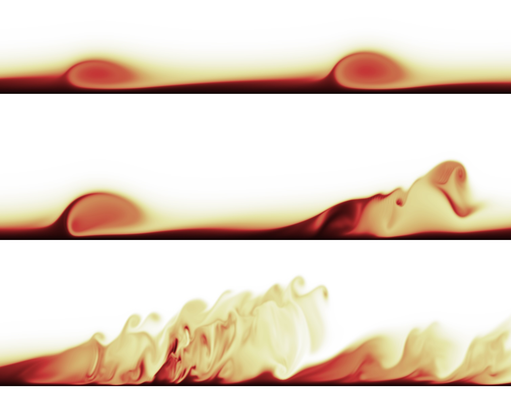
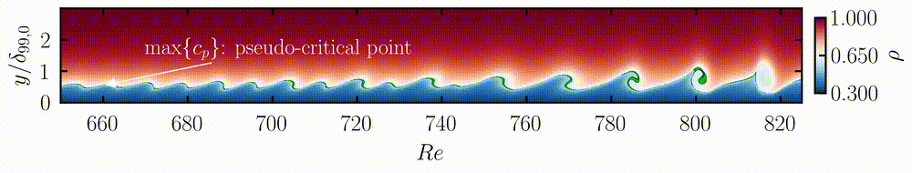

# DNS Visualisations

  

This repository contains movies of Direct Numerical Simulations (DNS) showing two-dimensional nonlinear forcing and three-dimensional breakdown to turbulence in a heated flat-plate boundary layer with a fluid at supercritical pressure. The movies are part of the publication:

> [**Add full citation or DOI here once available**]

---

## Explanation

### Movie #1: Two-dimensional simulation — nonlinear forcing under pseudo-boiling conditions

This movie (Figure 9 in the manuscript) illustrates contours of density (ρ) in an *xy*-plane over one forcing period (*T₀*, the period of the fundamental wave). The pseudo-critical point at *y = ypc* lies within the green region, i.e., between 98% of max(*cp*) and max(*cp*).

[▶️ View movie1.mp4](movies/Movie1.mp4)

---

### Movies #2, #3, and #4: Three-dimensional simulations — breakdown to turbulence

These movies (Figure 12 in the manuscript) show isosurfaces of the **Q-criterion**, colored by streamwise velocity magnitude, over one forcing period (*T₀*). The side *xy*-plane displays instantaneous spanwise vorticity (ωz). Separation zones (regions with *u* < 0) are shown as cyan isosurfaces in cases **Tw110-LA** and **Tw110-IA**. For clarity, the domain is repeated three times in the spanwise direction.

- **Movie #2**: Case **Tw095-LA** — Subcritical regime (*Q* = 0.015)  
    
  [▶️ View movie2.mp4](movies/Movie2.mp4)

- **Movie #3**: Case **Tw110-LA** — Transcritical regime with finite-amplitude oblique wave (*Q* = 0.020)  
    
  [▶️ View movie3.mp4](movies/Movie3.mp4)

- **Movie #4**: Case **Tw110-IA** — Transcritical regime with infinitesimal-amplitude oblique wave (*Q* = 0.020)  
    
  [▶️ View movie4.mp4](movies/Movie4.mp4)